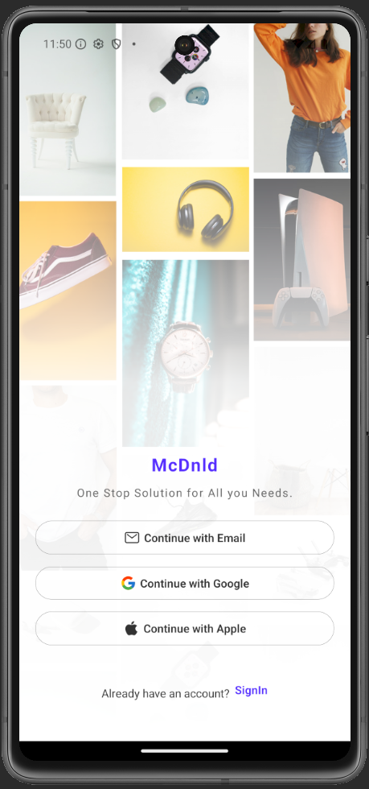
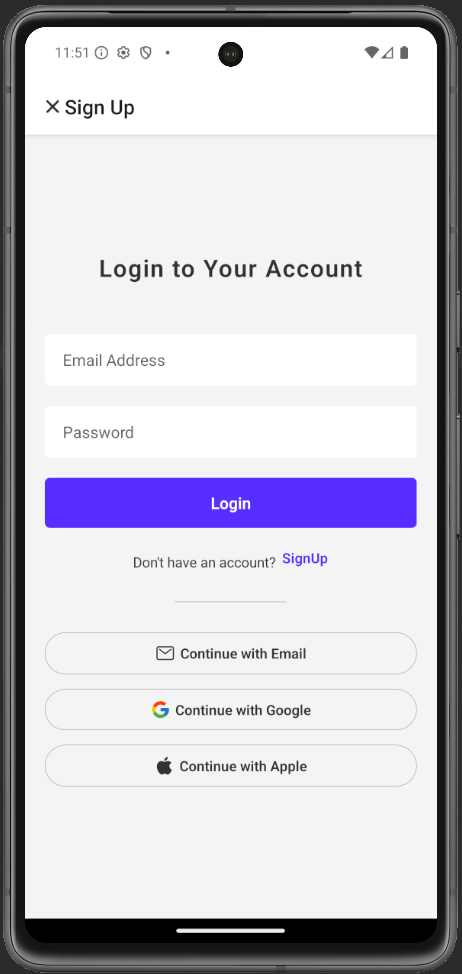
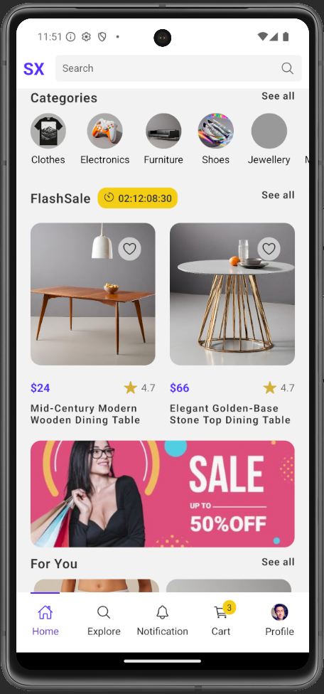
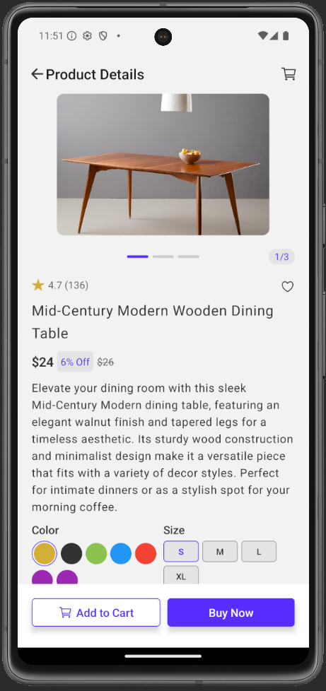
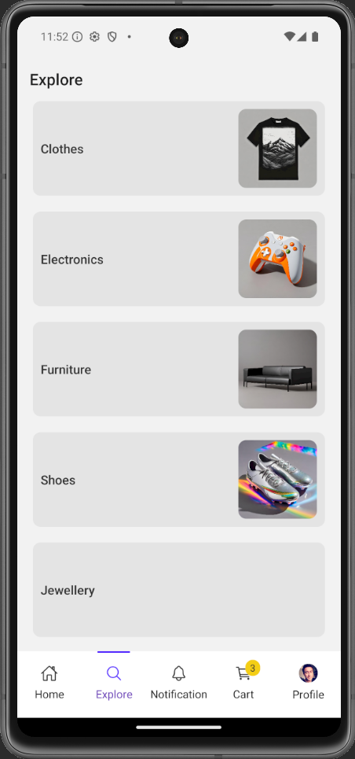
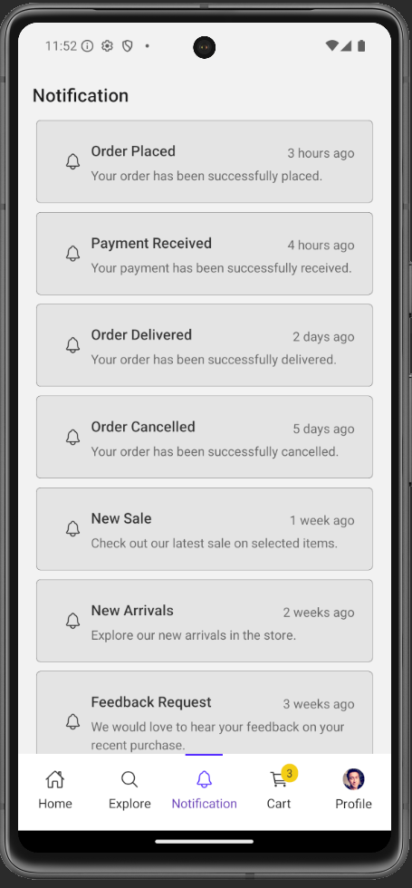
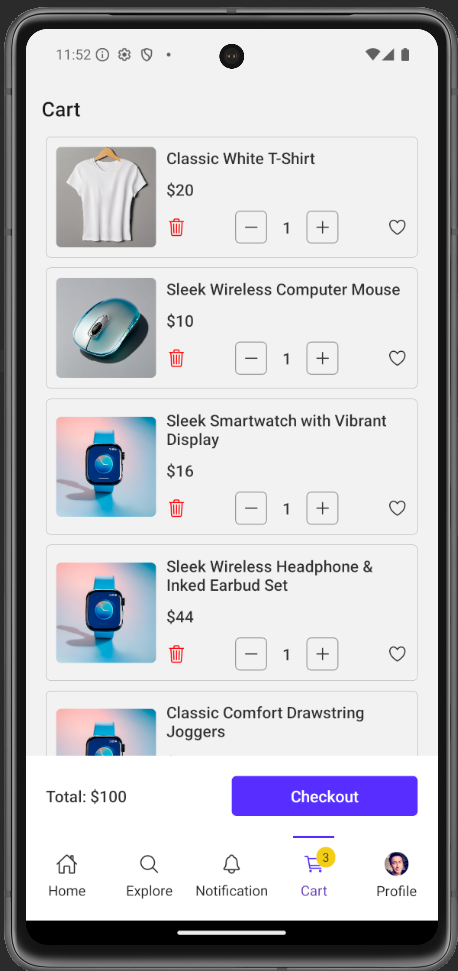

# Expo eCommerce App Starter Template 👋

This is a starter template for the expo eCommerce app tutorial on my YouTube channel.

## Get started

1. Install dependencies

   ```bash
   npm install
   ```


2. Start the app

   ```bash
    npx expo start
   ```

Extra dependencies added here

- [Axios](https://www.npmjs.com/package/axios)
- [Expo Linear Gradient](https://docs.expo.dev/versions/latest/sdk/linear-gradient/)
- [React Native SVG](https://github.com/software-mansion/react-native-svg#installation)
- [React Native SVG Transformer](https://github.com/kristerkari/react-native-svg-transformer#readme)

Additionally, I've used [JSON Server](https://github.com/typicode/json-server#readme) to create REST API endpoints based
on the json data provided in `data/db.json` file. I haven't installed it in this project, but I installed it globally on
my machine using `npm install -g json-server` command. To start up the JSON Server type this command into your terminal:
`json-server --watch data/db.json --port 8000`. If you don't use `--port` flag then it'll run
on "https://localhost:3000" by default.















